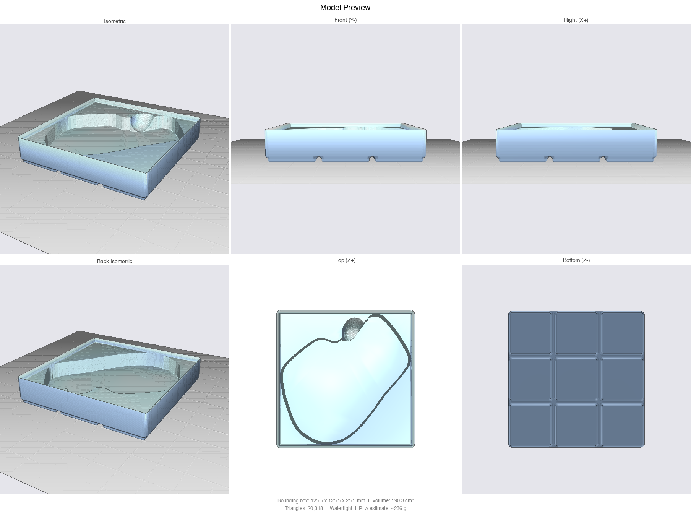

# Parametric CAD Skill for Codex

A Codex skill for designing and validating parametric, 3D-printable models with [CadQuery](https://cadquery.readthedocs.io/) and an optional FreeCAD MCP workflow. Describe a physical object or provide an existing FCStd model; Codex can build editable geometry, export manufacturing files, render previews, and run printability checks.

<p align="center">
  
  
</p>

Read the full write-up: [I Taught Claude to Design 3D-Printable Parts. Here's How](https://medium.com/@nchourrout/i-taught-claude-to-design-3d-printable-parts-heres-how-675f644af78a)

## More examples

Published on [MakerWorld](https://makerworld.com/en/@sercanto).

<p align="center">
  
</p>

<p align="center">
  
</p>

The MX Master 3 bin above ([examples/mx_master3_bin_3x3.py](examples/mx_master3_bin_3x3.py), [printed and published on MakerWorld](https://makerworld.com/en/models/3049470-gridfinity-bin-for-logitech-mx-master-3-3x3)) shows the scan-to-pocket pipeline: `outline_from_scan.py` traces the mouse's real footprint from a 3D scan, the outline is rotated to the angle that minimizes its bounding square so the bin fits a 3x3 grid instead of 4x3, and a tilted thumb scoop ramps under the thumb rest to lift the mouse out.

<p align="center">
  
  
</p>

## Installation

PowerShell:

```powershell
git clone https://github.com/hashbolic/cad-skill.git "$env:USERPROFILE\.codex\skills\parametric-3d-printing"
```

macOS/Linux:

```bash
git clone https://github.com/hashbolic/cad-skill.git "${CODEX_HOME:-$HOME/.codex}/skills/parametric-3d-printing"
```

## Usage

Once installed, the skill can be selected automatically for printable CAD work or invoked explicitly as `$parametric-3d-printing`.

Codex chooses FreeCAD MCP for existing FCStd documents and assembly-oriented work, CadQuery for headless parametric parts, or a hybrid route for complex enclosures. The workflow is autonomous by default and pauses only for missing information that can invalidate physical fit or safety.

## Dependencies

Requires **Python 3.10-3.12** (CadQuery's OCC kernel does not have wheels for 3.13+):

```bash
python3.12 -m venv .venv && source .venv/bin/activate
pip install -r requirements.txt
```

## Files

| File | Purpose |
|------|---------|
| `SKILL.md` | Codex skill definition and workflow routing |
| `agents/openai.yaml` | Codex UI metadata and invocation policy |
| `references/freecad-mcp.md` | Safe workflow for live FreeCAD documents |
| `references/bc250-enclosure.md` | BC250/Dell N870P-S0 enclosure requirements |
| `gridfinity.py` | Tested Gridfinity bin generator (base profile, stacking lip, magnets, compartments, custom pockets). Vendored next to generated scripts. |
| `outline_from_scan.py` | Extracts a pocket outline from a 3D scan of an object (align, scale, slice, union), ready for `add_polygon_pocket`. |
| `examples/` | Model scripts built on the gridfinity module (D110 cradle, MX Master 3 diagonal bin). |
| `preview.py` | Headless STL to 6-view PNG renderer (trimesh + pyrender). Use `--strict` to fail on non-watertight meshes. |
| `run_cadquery_model.py` | Subprocess wrapper that runs a CadQuery script, captures errors, works around the known Windows OCP shutdown crash, optionally renders the preview, and emits a JSON result so Codex can self-correct. |
| `mesh_io.py` | STL loading with validation (no pyrender dependency). Used by the wrapper and converter. |
| `stl_to_3mf.py` | Standalone STL to 3MF converter for Bambu Studio / PrusaSlicer. |
| `design-review.md` | Visual inspection checklist and printability analysis |
| `requirements.txt` | Pinned dependency versions |

## License

The skill and scripts are licensed under the [PolyForm Noncommercial License 1.0.0](LICENSE). Free to use, modify, and distribute for noncommercial purposes.

---

Originally created by [Nicolas Chourrout](https://github.com/nchourrout) from [Flowful.ai](https://flowful.ai). Codex/FreeCAD adaptation maintained in this fork by hashbolic.
